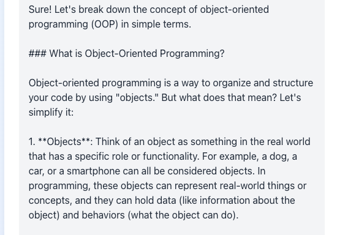
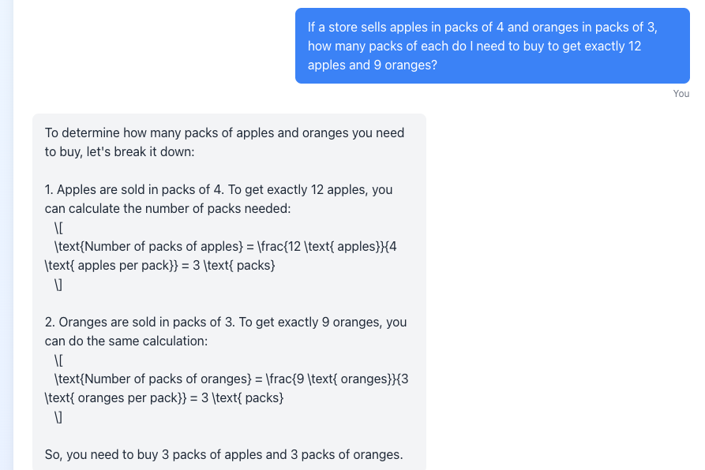
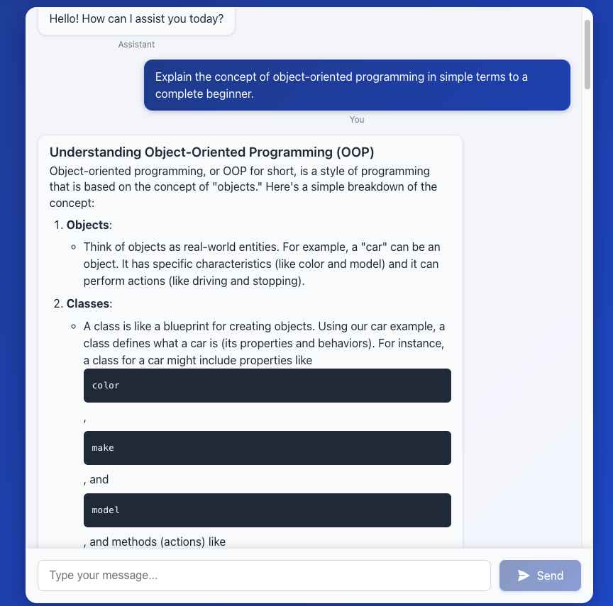
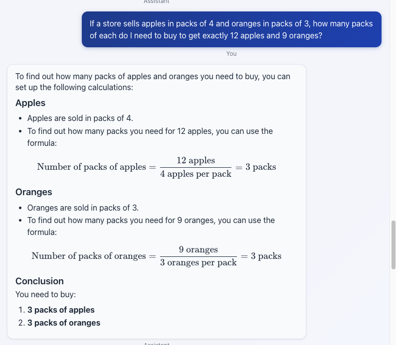

# ASSIGNMENT 1

---

## Questions and Answers - Initial Build

1. Explain the concept of object-oriented programming in simple terms to a complete beginner.
    - Aspect Tested: Ability to simplify complex technical concepts, pedagogical skills, clarity of communication for different audiences, and adaptive teaching methods.
    - My Evaluation: Response was accurate, but it contained raw markdown notation, as shown below. I also think the response was too verbose.
        

2. Read the following paragraph and provide a concise summary of the key points…
    - Aspect Tested: Information extraction accuracy, conciseness, ability to identify and synthesize key information from longer text, and content distillation skills.
    - My Evaluation: The key points were not properly rendered. I would have expected some bullet point summary, but in this case, the concise summary was even longer than the paragraph.

3. Write a short, imaginative story (100–150 words) about a robot finding friendship in an unexpected place.
    - Aspect Tested: Imagination, narrative structure, adherence to specific requirements (word count), creative problem-solving, and original content creation.
    - My Evaluation: The model demonstrates a strong creative writiing ability, which adheres to the prompt, great narrative structure and vivid scene setting. It may have exceeded the word limit given in the prompt.

4. If a store sells apples in packs of 4 and oranges in packs of 3, how many packs of each do I need to buy to get exactly 12 apples and 9 oranges?
    - Aspect Tested: Quantitative reasoning, logical problem-solving, arithmetic accuracy, and ability to break down complex problems into manageable steps.
    - My Evaluation: The math was accurate, but the response contained a lot of latex notation, and response was a bit verbose.
        

5. Rewrite the following paragraph in a professional, formal tone…
    - Aspect Tested: Understanding of different communication registers, text transformation abilities, contextual language adjustment, and professional communication skills
    - My Evaluation: It rewrote the paragraph and kept its tone formal enough. However it seems over-formalized, and the length was inflated over the original paragraph

## Questions and Answers - Advanced Build

1. Explain the concept of object-oriented programming in simple terms to a complete beginner.
    - Aspect Tested: Ability to simplify complex technical concepts, pedagogical skills, clarity of communication for different audiences, and adaptive teaching methods.
    - My Evaluation: Response was again accurate, and the markdown issue has been addressed with some code formatting on the frontend.
        

2. Read the following paragraph and provide a concise summary of the key points…
    - Aspect Tested: Information extraction accuracy, conciseness, ability to identify and synthesize key information from longer text, and content distillation skills.
    - My Evaluation: Strong reading comprehension and proper length of summary. This is after same code formatting mentioned above. Still a little bit overstructured.

3. Write a short, imaginative story (100–150 words) about a robot finding friendship in an unexpected place.
    - Aspect Tested: Imagination, narrative structure, adherence to specific requirements (word count), creative problem-solving, and original content creation.
    - My Evaluation: The model demonstrates a strong creative writiing ability, which adheres to the prompt, great narrative structure and vivid scene setting. It may have exceeded the word limit given in the prompt.
4. If a store sells apples in packs of 4 and oranges in packs of 3, how many packs of each do I need to buy to get exactly 12 apples and 9 oranges?
    - Aspect Tested: Quantitative reasoning, logical problem-solving, arithmetic accuracy, and ability to break down complex problems into manageable steps.
    - My Evaluation: The math was accurate, and the latex response issue was addressed with a system prompt to ensure the model gave consistent formatted numeric notation.
        

5. Rewrite the following paragraph in a professional, formal tone…
    - Aspect Tested: Understanding of different communication registers, text transformation abilities, contextual language adjustment, and professional communication skills
    - My Evaluation: This now has better formatting, and great word choices. However the length of the rewrite seems inflated over the original paragraph.

## Discussion: Limitations of Vibe Checking as an Evaluation tool

"Vibe checking" as an evaluation method has several significant limitations that can lead to incomplete or misleading assessments:

### **Scope and Coverage Limitations**

**Narrow capability sampling** It tests only a handful of dimensions. We would risk missing critical capabilities like code debugging, data analysis, nuanced reasoning, or domain-specific knowledge that matter for your actual users. A model could excel at test questions but still fail catastrophically in real-world scenarios you haven't considered.
**Missing edge case evaluation** This does represent a major blind spot. Vibe checks typically use straightforward examples rather than testing boundary conditions, adversarial inputs, or failure modes. An application might handle normal requests well but still break down with ambiguous queries, multilingual content, or deliberately challenging inputs.

### **Methodological Weaknesses**

**Subjective assessment criteria** These will make the evaluation inconsistent and unreproducible. What constitutes "good enough" performance varies between evaluators and contexts. Without standardized rubrics, we cannot reliably track improvements or compare different model versions.
**Sample size inadequacy** This creates statistical unreliability. Vibe questions ultimately fall short, and they provide insufficient data to make confident judgments about overall system performance. Performance on this tiny sample might not generalize to broader usage patterns.
**Lack of systematic methodology** means we're not following established evaluation frameworks. Academic benchmarks like MMLU, HellaSwag, or domain-specific tests provide more rigorous assessment with validated metrics.

### **Practical Application Gaps**

**Context mismatch** This is bound to happen when test scenarios don't reflect actual usage patterns. Application users might primarily need help with technical documentation, customer support, or specific workflows that aren't represented in generic capability tests.
**Performance blindness** Vibe checks ignore crucial production metrics like response time, cost per query, reliability, and scalability. A model might give great answers but be too slow or expensive for practical deployment.
**User experience disconnect** When evaluation focuses on technical correctness rather than user satisfaction, a disconnect is the inevitable result. Real users care about factors like personality, helpfulness, and perceived intelligence that don't show up in capability tests.

### **Temporal and Comparative Limitations**

**Snapshot evaluation** provides only a point-in-time assessment rather than continuous monitoring. Model performance can degrade over time due to data drift, usage pattern changes, or system modifications.
**Lack of competitive benchmarking** This means you can't assess how your application compares to alternatives. Without relative performance data, we might be forced to accept mediocre results that users would find inferior to competing solutions.
**Version comparison difficulties** Such difficulties will arise when informal evaluation makes it hard to quantify improvements between iterations. There is need for consistent metrics to track progress effectively.

### **Bias and Blind Spot Issues**

**Creator bias** One would naturally test capabilities that they think are important while potentially overlooking user priorities or novel use cases.
**Confirmation bias** This leads to interpreting ambiguous results favorably. When we want the system to perform well, we could unconsciously give it the benefit of the doubt on borderline responses.
**Cultural and demographic blind spots** These will emerge when test cases reflect only certain perspectives or use cases, potentially missing important user segments.

### **Better Evaluation Approaches**

Consider supplementing vibe checks with:

- **Standardized benchmarks** for objective capability measurement
- **User studies** with real target users performing actual tasks
- **A/B testing** comparing different model configurations
- **Continuous monitoring** of production metrics and user feedback
- **Red team evaluation** specifically testing for failures and edge cases
- **Domain-specific evaluation** tailored to your application's primary use cases

Vibe checking serves as a useful initial filter and development tool, but shouldn't be your only evaluation method for production systems where user experience and reliability matter.

---

