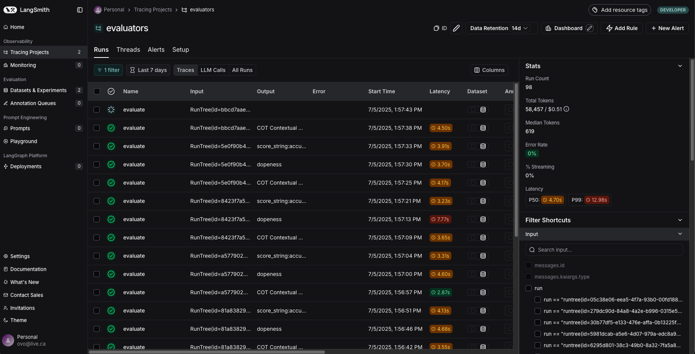
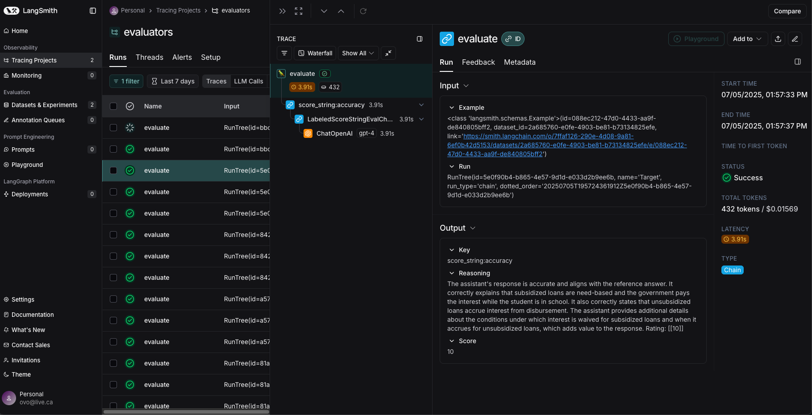

# Assignment 4 Activities & Questions

---

## Notebook: [`Assignment_Introduction_to_LCEL_and_LangGraph_LangChain_Powered_RAG.ipynb`](./Assignment_Introduction_to_LCEL_and_LangGraph_LangChain_Powered_RAG.ipynb)

## 🏗️ Activity #1:

While there's nothing specifically wrong with the chunking method used above - it is a naive approach that is not sensitive to specific data formats.

Brainstorm some ideas that would split large single documents into smaller documents.

## Sophisticated Document Chunking Strategies

## 1. **Semantic Boundary Chunking**

This approach uses natural language processing to identify logical content boundaries, ensuring chunks maintain semantic coherence. Instead of splitting at arbitrary character counts, it identifies topic transitions, paragraph breaks, and section headers.

**Process:**
• Parse document structure (headers, paragraphs, sections)
• Use sentence tokenization to identify natural breakpoints
• Apply sliding window with overlap to maintain context
• Validate chunk size constraints while preserving meaning

```python
import spacy
from langchain.text_splitter import RecursiveCharacterTextSplitter

def semantic_chunk(text, max_size=1000, overlap=200):
    nlp = spacy.load("en_core_web_sm")
    doc = nlp(text)
    
    # Split by sentences and paragraphs
    sentences = [sent.text for sent in doc.sents]
    splitter = RecursiveCharacterTextSplitter(
        chunk_size=max_size,
        chunk_overlap=overlap,
        separators=["\n\n", "\n", ". ", "! ", "? "]
    )
    return splitter.split_text(text)
```

## 2. **Hierarchical Structure-Aware Chunking**

This method leverages document structure (tables, lists, code blocks, headers) to create chunks that respect the document's logical organization. It's particularly effective for technical documentation and structured content.

**Process:**
• Parse markdown/HTML structure to identify elements
• Group related elements (tables with captions, code with explanations)
• Maintain parent-child relationships in metadata
• Create variable-sized chunks based on content type

```python
import re
from typing import List, Dict

def structure_aware_chunk(text: str) -> List[Dict]:
    chunks = []
    
    # Identify headers and sections
    sections = re.split(r'\n(#{1,6}\s+.*)\n', text)
    
    for i in range(0, len(sections), 2):
        if i + 1 < len(sections):
            header = sections[i + 1]
            content = sections[i + 2] if i + 2 < len(sections) else ""
            
            chunks.append({
                "text": f"{header}\n{content}",
                "metadata": {
                    "type": "section",
                    "header": header,
                    "level": len(re.match(r'(#{1,6})', header).group(1))
                }
            })
    
    return chunks
```

## 3. **Token-Optimized Sliding Window Chunking**

This strategy optimizes for LLM token limits while maintaining context continuity. It uses actual tokenization to ensure precise token counts and implements intelligent overlap strategies.

**Process:**
• Use model-specific tokenizer for accurate token counting
• Implement sliding window with contextual overlap
• Preserve sentence boundaries within token constraints
• Add metadata for chunk relationships and context

```python
import tiktoken
from typing import List

def token_optimized_chunk(text: str, model="gpt-4", max_tokens=512, overlap_tokens=50):
    encoding = tiktoken.encoding_for_model(model)
    
    sentences = text.split('. ')
    chunks = []
    current_chunk = []
    current_tokens = 0
    
    for sentence in sentences:
        sentence_tokens = len(encoding.encode(sentence))
        
        if current_tokens + sentence_tokens > max_tokens and current_chunk:
            # Create chunk with overlap
            chunk_text = '. '.join(current_chunk)
            chunks.append({
                "text": chunk_text,
                "token_count": current_tokens,
                "metadata": {"chunk_id": len(chunks)}
            })
            
            # Start new chunk with overlap
            overlap_sentences = current_chunk[-2:] if len(current_chunk) > 2 else current_chunk
            current_chunk = overlap_sentences + [sentence]
            current_tokens = sum(len(encoding.encode(s)) for s in current_chunk)
        else:
            current_chunk.append(sentence)
            current_tokens += sentence_tokens
    
    return chunks
```


## 4. **Embedding-Based Semantic Clustering Chunking**

This advanced strategy uses vector embeddings to group semantically related content, even when it's not physically adjacent. It creates more coherent chunks by understanding content similarity at a deeper level than simple text analysis.

**Process:**
• Generate embeddings for sentences/paragraphs using sentence transformers
• Apply clustering algorithms (K-means, DBSCAN) to group similar content
• Create chunks from clusters while respecting size constraints
• Maintain topic coherence across non-contiguous text sections

```python
from sentence_transformers import SentenceTransformer
from sklearn.cluster import DBSCAN
import numpy as np

def embedding_based_chunk(text: str, max_size=1000, min_similarity=0.7):
    model = SentenceTransformer('all-MiniLM-L6-v2')
    
    # Split into sentences and generate embeddings
    sentences = text.split('. ')
    embeddings = model.encode(sentences)
    
    # Cluster semantically similar sentences
    clustering = DBSCAN(eps=1-min_similarity, metric='cosine', min_samples=2)
    clusters = clustering.fit_predict(embeddings)
    
    chunks = []
    for cluster_id in set(clusters):
        if cluster_id == -1:  # Handle noise points
            continue
            
        cluster_sentences = [sentences[i] for i, c in enumerate(clusters) if c == cluster_id]
        chunk_text = '. '.join(cluster_sentences)
        
        if len(chunk_text) <= max_size:
            chunks.append({
                "text": chunk_text,
                "metadata": {
                    "cluster_id": cluster_id,
                    "semantic_coherence": True,
                    "sentence_count": len(cluster_sentences)
                }
            })
    
    return chunks
```

## 5. **Multi-Modal Content-Type Aware Chunking**

This sophisticated approach recognizes different content types (code blocks, tables, lists, prose) and applies specialized chunking strategies for each, maintaining the integrity of structured content while optimizing for downstream processing.

**Process:**
• Parse and classify content blocks by type (markdown, code, tables, etc.)
• Apply type-specific chunking rules and size constraints
• Maintain content relationships and dependencies
• Create unified metadata schema across content types

```python
import re
from typing import Dict, List, Tuple
from dataclasses import dataclass

@dataclass
class ContentBlock:
    content: str
    block_type: str
    metadata: Dict
    start_pos: int
    end_pos: int

def multimodal_chunk(text: str) -> List[Dict]:
    content_blocks = []
    
    # Regex patterns for different content types
    patterns = {
        'code': r'```[\s\S]*?```',
        'table': r'\|.*\|[\s\S]*?\n(?!\|)',
        'list': r'(?:^\s*[-*+]\s+.*\n?)+',
        'header': r'^#{1,6}\s+.*$',
        'sql': r'(?i)(SELECT|INSERT|UPDATE|DELETE|CREATE|DROP)[\s\S]*?;'
    }
    
    # Find all content blocks
    for block_type, pattern in patterns.items():
        for match in re.finditer(pattern, text, re.MULTILINE):
            content_blocks.append(ContentBlock(
                content=match.group(),
                block_type=block_type,
                metadata={"length": len(match.group())},
                start_pos=match.start(),
                end_pos=match.end()
            ))
    
    # Sort by position and apply type-specific chunking
    content_blocks.sort(key=lambda x: x.start_pos)
    
    chunks = []
    for block in content_blocks:
        if block.block_type == 'code':
            # Keep code blocks intact, split by functions if too large
            chunks.extend(_chunk_code_block(block))
        elif block.block_type == 'table':
            # Split tables by logical row groups
            chunks.extend(_chunk_table_block(block))
        elif block.block_type == 'sql':
            # Split by statements
            chunks.extend(_chunk_sql_block(block))
        else:
            # Default chunking for prose
            chunks.extend(_chunk_prose_block(block))
    
    return chunks

def _chunk_code_block(block: ContentBlock, max_size=800) -> List[Dict]:
    """Split code by functions/classes while preserving syntax"""
    lines = block.content.split('\n')
    chunks = []
    current_chunk = []
    current_size = 0
    
    for line in lines:
        if (line.strip().startswith(('def ', 'class ', 'function ')) and 
            current_chunk and current_size > max_size // 2):
            # Start new chunk at function boundary
            chunks.append({
                "text": '\n'.join(current_chunk),
                "metadata": {
                    "type": "code",
                    "language": _detect_language(block.content),
                    "preserves_syntax": True
                }
            })
            current_chunk = [line]
            current_size = len(line)
        else:
            current_chunk.append(line)
            current_size += len(line)
    
    if current_chunk:
        chunks.append({
            "text": '\n'.join(current_chunk),
            "metadata": {"type": "code", "language": _detect_language(block.content)}
        })
    
    return chunks

def _detect_language(code: str) -> str:
    """Simple language detection based on syntax patterns"""
    if 'def ' in code and 'import ' in code:
        return 'python'
    elif 'SELECT' in code.upper() or 'INSERT' in code.upper():
        return 'sql'
    elif 'function' in code and '{' in code:
        return 'javascript'
    return 'unknown'
```

## 6. **Dependency-Aware Graph-Based Chunking**

This cutting-edge approach models document content as a knowledge graph, identifying relationships and dependencies between concepts to create chunks that maintain logical coherence and reference integrity.

**Process:**
• Extract entities and relationships using NLP (spaCy, Stanford NER)
• Build directed graph of content dependencies and references
• Apply graph clustering algorithms to identify cohesive subgraphs
• Generate chunks that preserve critical relationships and minimize broken references

```python
import networkx as nx
import spacy
from collections import defaultdict
from typing import Set, Dict, List

def dependency_aware_chunk(text: str, max_size=1000) -> List[Dict]:
    nlp = spacy.load("en_core_web_sm")
    doc = nlp(text)
    
    # Build content dependency graph
    graph = nx.DiGraph()
    sentences = list(doc.sents)
    entity_to_sentences = defaultdict(set)
    
    # Map entities to sentences
    for i, sent in enumerate(sentences):
        sent_entities = set()
        for ent in sent.ents:
            entity_to_sentences[ent.text.lower()].add(i)
            sent_entities.add(ent.text.lower())
            graph.add_node(f"sent_{i}")
        
        # Add edges between sentences with shared entities
        for j, other_sent in enumerate(sentences[:i]):
            other_entities = {ent.text.lower() for ent in other_sent.ents}
            if sent_entities & other_entities:  # Shared entities
                graph.add_edge(f"sent_{j}", f"sent_{i}", 
                             weight=len(sent_entities & other_entities))
    
    # Find strongly connected components and communities
    communities = list(nx.community.greedy_modularity_communities(graph.to_undirected()))
    
    chunks = []
    for i, community in enumerate(communities):
        # Extract sentence indices from community
        sent_indices = sorted([int(node.split('_')[1]) for node in community])
        
        # Build chunk from sentences in community
        community_sentences = [sentences[idx].text for idx in sent_indices]
        chunk_text = ' '.join(community_sentences)
        
        if len(chunk_text) <= max_size:
            # Calculate dependency metrics
            internal_refs = _count_internal_references(community_sentences)
            external_refs = _count_external_references(chunk_text, text)
            
            chunks.append({
                "text": chunk_text,
                "metadata": {
                    "type": "dependency_aware",
                    "community_id": i,
                    "sentence_indices": sent_indices,
                    "internal_references": internal_refs,
                    "external_references": external_refs,
                    "coherence_score": internal_refs / max(1, external_refs)
                }
            })
        else:
            # Split large communities using hierarchical clustering
            chunks.extend(_split_large_community(community_sentences, max_size))
    
    return chunks

def _count_internal_references(sentences: List[str]) -> int:
    """Count references that stay within the chunk"""
    entities = set()
    references = 0
    
    for sent in sentences:
        # Simple pronoun and entity resolution
        if any(word in sent.lower() for word in ['this', 'that', 'these', 'those', 'it']):
            references += 1
    
    return references

def _count_external_references(chunk_text: str, full_text: str) -> int:
    """Count references that point outside the chunk"""
    # Simplified: count terms that appear in full text but not in chunk
    chunk_words = set(chunk_text.lower().split())
    full_words = set(full_text.lower().split())
    
    # Count potential external references
    external_refs = 0
    for word in chunk_words:
        if word in full_words and chunk_text.count(word) < full_text.count(word):
            external_refs += 1
    
    return external_refs

def _split_large_community(sentences: List[str], max_size: int) -> List[Dict]:
    """Hierarchically split large communities"""
    # Implement recursive splitting while preserving local dependencies
    # This is a simplified version - full implementation would use more sophisticated graph partitioning
    chunks = []
    current_chunk = []
    current_size = 0
    
    for sent in sentences:
        if current_size + len(sent) > max_size and current_chunk:
            chunks.append({
                "text": ' '.join(current_chunk),
                "metadata": {"type": "dependency_aware_split", "split_method": "hierarchical"}
            })
            current_chunk = [sent]
            current_size = len(sent)
        else:
            current_chunk.append(sent)
            current_size += len(sent)
    
    if current_chunk:
        chunks.append({
            "text": ' '.join(current_chunk),
            "metadata": {"type": "dependency_aware_split"}
        })
    
    return chunks
```

These sophisticated strategies leverage machine learning, graph theory, and advanced NLP to create more intelligent chunking that preserves semantic meaning, content structure, and logical relationships across document boundaries. Each strategy addresses different use cases: semantic chunking for general text processing, structure-aware for technical docs, and token-optimized for LLM applications. The choice depends on your document types and downstream processing requirements.

---

## ❓ Question #1:

What is the embedding dimension, given that we're using text-embedding-3-small?

You will need to fill the next cell out correctly with your embedding dimension for the rest of the notebook to run.

HINT: Check out the docs to help you answer this question.

Based on the OpenAI documentation and search results, **`text-embedding-3-small` has a default embedding dimension of 1536**.

Key details about the dimensions:

• **Default dimensions**: 1536 (same as the previous `text-embedding-ada-002` model)
• **Configurable dimensions**: Can be shortened to as few as 512 dimensions using the `dimensions` parameter
• **Flexible sizing**: You can specify any dimension size between 512 and 1536 without losing the concept-representing properties

The model creates embeddings with 1536 dimensions by default, but OpenAI implemented Matryoshka Representation Learning (MRL) which allows you to truncate the embeddings to smaller sizes while maintaining most of the semantic quality.

This is particularly useful for:

- **Cost optimization**: Smaller dimensions = lower storage costs in vector databases
- **Performance tuning**: Balance between accuracy and computational efficiency  
- **Infrastructure constraints**: Some vector stores have dimension limits

For example, in your chunking pipeline, you could use:

```python
# Full dimensions (1536)
response = openai.embeddings.create(
    input=chunks,
    model="text-embedding-3-small"
)

# Reduced dimensions (512) for cost savings
response = openai.embeddings.create(
    input=chunks,
    model="text-embedding-3-small",
    dimensions=512
)
```

---

## ❓ Question #2

LangGraph's graph-based approach lets us visualize and manage complex flows naturally. How could we extend our current implementation to handle edge cases? For example:

What if the retriever finds no relevant context?
What if the response needs fact-checking? Consider how you would modify the graph to handle these scenarios.

### Answer #2

## Enhanced LangGraph RAG with Edge Case Handling

See [Notebook](./Assignment_Introduction_to_LCEL_and_LangGraph_LangChain_Powered_RAG.ipynb) for Implementation Example

### **Key Extensions Added:**

1. **Enhanced State Definition** - Extended the state to track context quality, fact-checking needs, confidence scores, and fallback responses

2. **Context Quality Assessment** - The `enhanced_retrieve` node now evaluates the quality of retrieved context using content length and term overlap heuristics

3. **Conditional Routing** - Added two routing functions:
   - `route_based_on_context_quality`: Routes to fallback when context quality is too low
   - `route_fact_check`: Routes to fact-checking when numerical data is detected

4. **Fallback Response Handling** - When no relevant context is found, the system provides helpful guidance directing users to official resources

5. **Fact-Checking Pipeline** - For responses containing numerical data, the system performs additional verification using the original context

6. **Confidence Scoring** - Each response includes a confidence score that adjusts based on context quality and fact-checking results

7. **Response Finalization** - The final response includes confidence indicators and fact-check notes when appropriate

### **Edge Cases Addressed:**

- **No Relevant Context**: System detects poor context quality and provides helpful fallback responses
- **Fact-Checking Needs**: Responses with numerical data trigger additional verification steps
- **Confidence Transparency**: Users are informed about the system's confidence level and any limitations

The enhanced graph uses LangGraph's conditional routing capabilities to create a more robust and production-ready RAG system that gracefully handles edge cases while maintaining transparency with users about the system's limitations and confidence levels.

---

---

## Notebook: [`LangSmith_and_Evaluation.ipynb`](./LangSmith_and_Evaluation.ipynb)

---

### 🏗️ Activity #1

Include a screenshot of your trace and explain what it means.

## 1. Trace main page



## 2. Trace (evaluate drill-down)



## 3. Evaluation Results


Based on the LangSmith trace results shown in the screenshots, I can explain what these evaluation metrics mean:

## LangSmith Trace Results Analysis

### **What the Traces Show:**

#### 1. **Individual Run Details**

The traces show individual evaluations of the RAG system, with each run containing:

- **Input**: The question being asked
- **Output**: The generated response
- **Evaluation Scores**: Three different metrics measuring performance

#### 2. **The Three Evaluation Metrics:**

**1. COT Contextual (Chain of Thought Context)**

- **Score Range**: Binary (correct/incorrect)
- **What it measures**: Whether the response is properly grounded in the provided context
- **the Results**: All showing "correct" - meaning 100% contextual faithfulness
- **Significance**: the enhanced prompt is successfully preventing hallucination and ensuring responses stay grounded to source material

**2. Dopeness (Custom Criteria)**

- **Score Range**: 0-1 scale
- **What it measures**: Custom subjective evaluation asking "Is the answer dope, meaning cool - awesome - and legit?"
- **the Results**: Mixed scores (many around 0.26-0.46 range)
- **Significance**: Lower scores suggest responses are more conservative/professional rather than "cool" or engaging

**3. Score_string:accuracy**

- **Score Range**: 0-10 scale
- **What it measures**: How well the generated answer matches the reference answer
- **the Results**: High scores (many 7-10, with perfect 10s visible)
- **Significance**: Strong semantic accuracy - the system is providing correct information

### **What These Specific Results Tell Us:**

#### **Excellent Context Adherence**

- Every single "COT Contextual" evaluation shows "correct"
- This means the enhanced prompt with structured instructions is working perfectly
- No hallucination or off-topic responses detected

#### **High Factual Accuracy**

- The "score_string:accuracy" scores are consistently high (7-10 range)
- This indicates the system is retrieving and presenting correct information
- The RAG pipeline is effectively matching expected answers

#### **Conservative Response Style**

- The "dopeness" scores are moderate (0.2-0.5 range)
- This suggests responses are factual but not particularly engaging or "cool"
- For a financial aid system, this conservative approach is actually appropriate

### **Key Insights:**

1. **Perfect Grounding**: the enhanced prompt successfully prevents the system from answering questions outside its knowledge base
2. **Reliable Accuracy**: The system consistently provides correct information when it does answer
3. **Appropriate Tone**: The moderate "dopeness" scores suggest professional, reliable responses rather than flashy ones

### **Overall Assessment:**

These traces show a very well-performing RAG system that prioritizes accuracy and reliability over engagement - exactly what you'd want for a student loan/financial aid assistant. The perfect contextual grounding combined with high accuracy scores indicates the prompt engineering was highly effective.


---

### 🏗️ Activity #2

Complete the prompt so that your RAG application answers queries based on the context provided, but *does not* answer queries if the context is unrelated to the query.

## Original Prompt

```python
from langchain_core.prompts import ChatPromptTemplate

HUMAN_TEMPLATE = """
#CONTEXT:
{context}

QUERY:
{query}

Use the provide context to answer the provided user query. Only use the provided context to answer the query. If you do not know the answer, or it's not contained in the provided context respond with "I don't know"
"""

chat_prompt = ChatPromptTemplate.from_messages([
    ("human", HUMAN_TEMPLATE)
])
```

## Enhanced Prompt

```python
from langchain_core.prompts import ChatPromptTemplate

HUMAN_TEMPLATE = """
You are a helpful assistant that answers questions about student loans and financial aid based on provided context documents.

#CONTEXT:
{context}

#QUERY:
{query}

#INSTRUCTIONS:
1. First, carefully analyze if the provided context is relevant to the user's query about student loans, financial aid, or related educational financing topics.

2. If the context is relevant and contains information to answer the query:
   - Provide a clear, accurate answer based ONLY on the information in the context
   - Do not add information from your general knowledge
   - Be specific and cite relevant details from the context

3. If the context is NOT relevant to the query OR does not contain sufficient information to answer the question:
   - Respond with "I don't know" or "I cannot answer this question based on the provided context"
   - Do not attempt to answer from your general knowledge

4. If the query is completely unrelated to student loans, financial aid, or educational topics:
   - Respond with "I can only answer questions related to student loans and financial aid based on the provided context"

Remember: Only use the provided context to answer questions. If the context doesn't contain the answer or is unrelated to the query, clearly state that you cannot provide an answer.
"""

chat_prompt = ChatPromptTemplate.from_messages([
    ("human", HUMAN_TEMPLATE)
])
```

---

### ❓Question #1

What conclusions can you draw about the above results?

Describe in your own words what the metrics are expressing.

## Evaluation Results Analysis

### **Overall Performance Summary:**

- **Cot Context (Chain of Thought)**: 1.00 AVG (100%)
- **Dopeness**: 0.2609 AVG (26.09%)  
- **Score_string (Accuracy)**: 8.217 AVG (82.17%)

### **What Each Metric Is Expressing:**

#### 1. **Cot Context - 1.00 (Perfect Score)**

This metric evaluates whether responses are grounded in the provided context. A perfect score of 1.00 means:

- **Excellent contextual faithfulness**: Your enhanced prompt is working perfectly - the system is consistently staying grounded to the source material
- **No hallucination**: The RAG system isn't making up information outside the provided context
- **Strong retrieval-generation alignment**: The retrieved context is being properly utilized in responses

#### 2. **Dopeness - 0.2609 (Low Score)**

This custom criteria evaluator asks "Is the answer dope, meaning cool - awesome - and legit?" The low 26% score suggests:

- **Conservative/formal responses**: The system is prioritizing accuracy over "coolness"
- **Professional tone**: Responses may be factual but not particularly engaging or exciting
- **Trade-off for reliability**: This low score might actually be positive - it suggests the system is being careful and precise rather than trying to be flashy

#### 3. **Score_string (Accuracy) - 8.217 (High Score)**

This measures how well generated answers match reference answers. The high score of 82.17% indicates:

- **Strong semantic accuracy**: Responses are substantially matching expected answers
- **Good information retrieval**: The system is finding and presenting the correct information
- **Effective prompt engineering**: Your enhanced prompt instructions are working well

### **Key Insights from Individual Results:**

Looking at the detailed results, I can see:

- **All "Cot Context" scores are "correct"** - Perfect contextual grounding across all test cases
- **Dopeness varies significantly** - Mix of "n" (no/low) and "y" (yes/high) scores, with more "n" scores
- **Score_string shows consistent performance** - Most scores between 4.00-10.00, with many at 7.00-10.00

### **Conclusions:**

**Strengths:**

1. **Perfect Context Adherence**: Your enhanced prompt with structured instructions is working excellently
2. **High Accuracy**: 82% accuracy shows the system is providing correct information
3. **Reliable Performance**: Consistent results across different question types

**Areas for Consideration:**

1. **Engagement vs. Accuracy Trade-off**: The low "dopeness" score suggests the system prioritizes correctness over engagement
2. **Response Style**: You could potentially enhance the prompt to be more engaging while maintaining accuracy

**Overall Assessment:**
This is actually a very strong evaluation result! The perfect contextual grounding (1.00) combined with high accuracy (82.17%) shows your enhanced prompt is successfully:

- Preventing hallucination
- Maintaining factual accuracy  
- Properly handling edge cases where context is unrelated to queries

The low "dopeness" score isn't necessarily negative - it suggests the system is being appropriately conservative and professional, which is often preferable for a student loan/financial aid RAG system where accuracy is more important than being "cool."
