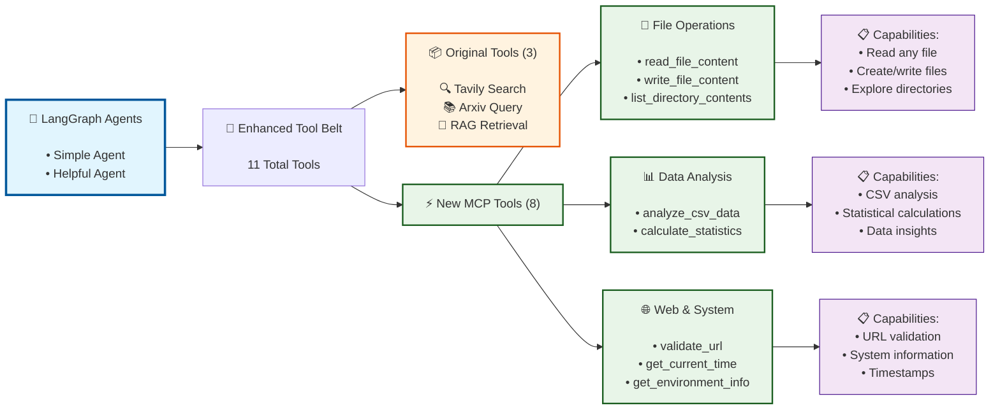
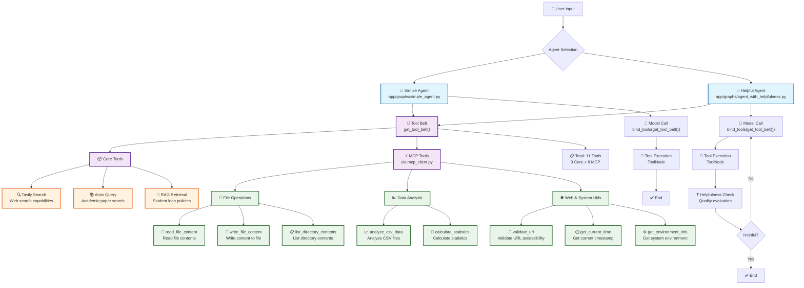

# Session 14 Assignment Answers

## Agent Structure Overview - Enhanced with MCP Tools

### Simplified Tool Overview



---

## Assignment Questions & Answers

### ❓ Question 1: chunk_overlap Parameter in RecursiveCharacterTextSplitter

What is the purpose of the chunk_overlap parameter when using RecursiveCharacterTextSplitter to prepare documents for RAG, and what trade-offs arise as you increase or decrease its value?

**✅ Answer:**

The `chunk_overlap` parameter maintains **contextual continuity** by creating overlapping regions between adjacent chunks, preventing information loss at boundaries.

**Current Implementation:** The project uses `chunk_overlap=0` (no overlap), prioritizing efficiency over context preservation.

**Trade-offs Analysis:**

**Higher overlap (↑ 100-200 chars):**
- ✅ Better context preservation, improved retrieval accuracy
- ✅ Maintains sentence/paragraph integrity across chunks
- ❌ Increased storage/processing costs, potential redundancy

**Current setting (overlap=0):**
- ✅ Maximum efficiency, no duplicate content
- ✅ Faster processing, reduced storage
- ❌ Risk of context loss at chunk boundaries
- ❌ Potential semantic fragmentation

**Recommendation:** For technical documents like student loan policies, 50-100 char overlap would improve retrieval quality with minimal overhead.

---

### ❓ Question 2: Impact of k Parameter on RAGAS Metrics

Your retriever is configured with search_kwargs={"k": 5}. How would adjusting k likely affect RAGAS metrics such as Context Precision and Context Recall in practice, and why?

**✅ Answer:**

The retriever is configured with `search_kwargs={"k": 5}`, retrieving 5 chunks per query. Adjusting `k` creates a fundamental **precision-recall trade-off** that directly impacts RAGAS metrics.

**Increasing k (k=8-12):**
- **Context Recall:** 📈 **IMPROVES** - Higher probability of retrieving all relevant information
  - More chunks = broader coverage of potentially relevant passages
  - Reduces risk of missing critical details across document sections
- **Context Precision:** 📉 **DEGRADES** - Lower-ranked chunks dilute overall relevance
  - Additional chunks likely less relevant, reducing precision ratio
  - Noise introduction from marginally relevant content

**Decreasing k (k=2-3):**
- **Context Recall:** 📉 **DEGRADES** - Higher risk of missing relevant information  
  - Fewer chunks = potential gaps in comprehensive coverage
  - Critical information might be in 4th or 5th ranked chunk
- **Context Precision:** 📈 **IMPROVES** - Only highest-confidence chunks retrieved
  - Top-ranked chunks typically most relevant to query
  - Cleaner, more focused context for generation

**Practical Impact on Student Loan Documents:**
- **Current k=5:** Balanced approach for policy complexity
- **k=3:** Suitable for specific, well-defined queries
- **k=8-10:** Better for complex multi-aspect questions
- **k>10:** Diminishing returns, likely introduces noise

**Optimization Strategy:** Monitor both metrics together - aim for maximum recall while maintaining acceptable precision threshold (typically >0.7).

---

### ❓ Question 3: Agent vs Agent_Helpful Comparison

Compare the agent and agent_helpful assistants defined in langgraph.json. Where does the helpfulness evaluator fit in the graph, and under what condition should execution route back to the agent vs. terminate?

**✅ Answer:**

**System Prompts & Architecture:**

**Main Agents:** Both agents use **identical underlying models** (`get_chat_model()`) with **no explicit system prompts** - they rely on default LLM behavior and message history.

**Helpfulness Evaluator:** Uses a **specific prompt template** for quality assessment:
```
"Given an initial query and a final response, determine if the final response is extremely helpful or not. Please indicate helpfulness with a 'Y' and unhelpfulness as an 'N'."
```

**RAG Tool:** Has its own **constrained prompt template** when agents use the retrieve_information tool:
```
"\n#CONTEXT:\n{context}\n\nQUERY:\n{query}\n\n"
"Use the provided context to answer the provided user query. Only use the provided context to answer the query. If you do not know the answer, or it's not contained in the provided context respond with 'I don't know'"
```

**Agent Comparison:**

| Aspect | Simple Agent | Helpful Agent |
|--------|-------------|---------------|
| **Graph ID** | `simple_agent` | `agent_with_helpfulness` |
| **Flow** | User → Agent → Tools → END | User → Agent → Tools → Helpfulness Check → Decision |
| **Main Agent Model** | Default ChatOpenAI (gpt-4.1-nano) | Default ChatOpenAI (gpt-4.1-nano) |
| **Main Agent Prompt** | None (default LLM behavior) | None (default LLM behavior) |
| **Evaluation Model** | None | GPT-4.1-mini (separate instance) |
| **Evaluation Prompt** | None | Explicit helpfulness assessment template |
| **Tool Prompts** | RAG: constrained context-only responses | RAG: constrained context-only responses |
| **Quality Gate** | No post-response validation | Yes - binary helpful/unhelpful check |
| **Loop Prevention** | N/A | 10-message limit + safety markers |
| **Response Strategy** | Single-pass completion | Iterative improvement until helpful |

**Helpfulness Evaluator Position & Flow:**

The helpfulness evaluator sits as a **quality gate** between agent completion and termination:
```
User Query → Agent → Tools → Response → Helpfulness Check → Decision
```

**Routing Logic:**
1. **Agent generates response** using available tools
2. **Helpfulness node evaluates** response quality using dedicated prompt
3. **Decision routing:**
   - **"Y" (Helpful)** → TERMINATE with response
   - **"N" (Unhelpful)** → Route BACK to agent for improvement
   - **Loop safety** → TERMINATE after 10 iterations

**Key Architectural Insight:** 
- **Simple Agent:** Direct execution path (User → Agent → Tools → END)
- **Helpful Agent:** Quality-gated execution with feedback loop
- **Shared Foundation:** Identical models, tools, and core behavior
- **Quality Control:** Post-hoc evaluation vs. pre-response filtering

---

## Detailed Agent Architecture



---

## Summary

This analysis demonstrates how LangGraph agents leverage enhanced tooling through MCP integration, expanding capabilities from 3 to 11 tools while maintaining core architectural simplicity. The agents operate without explicit system prompts, relying on tool-specific constraints (RAG) and optional post-response evaluation (Helpful Agent) for quality control.
