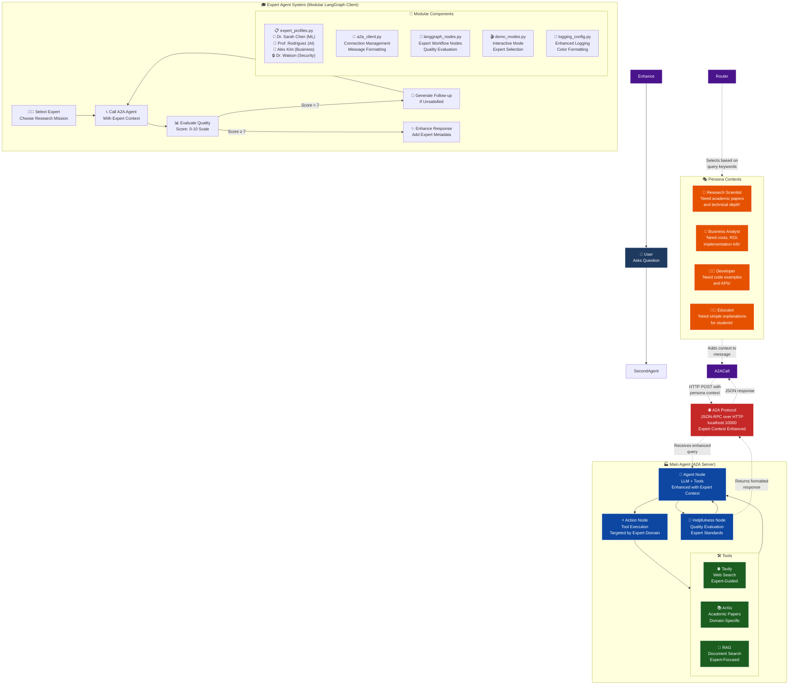
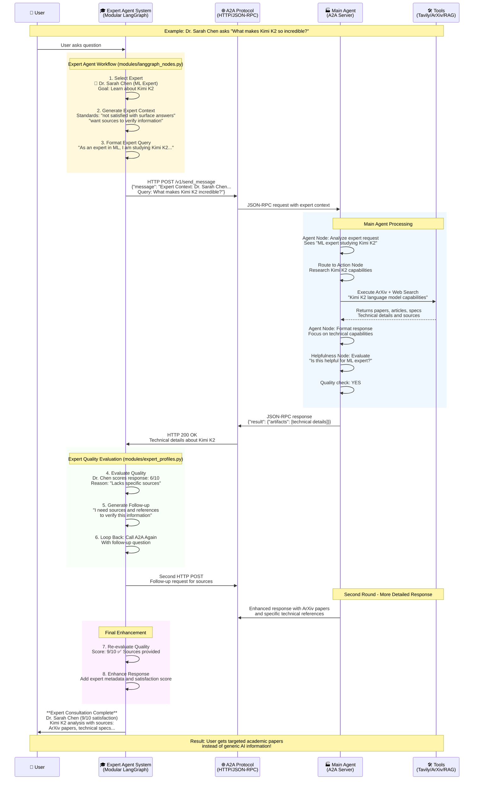
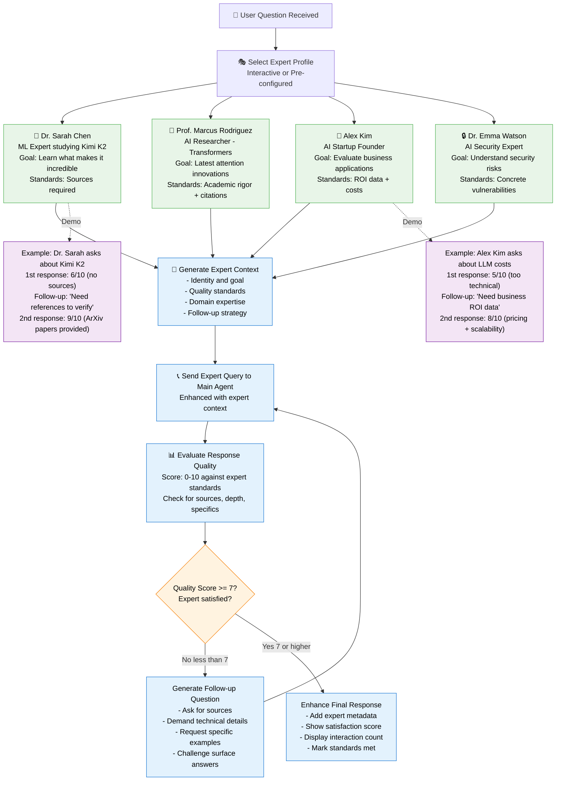
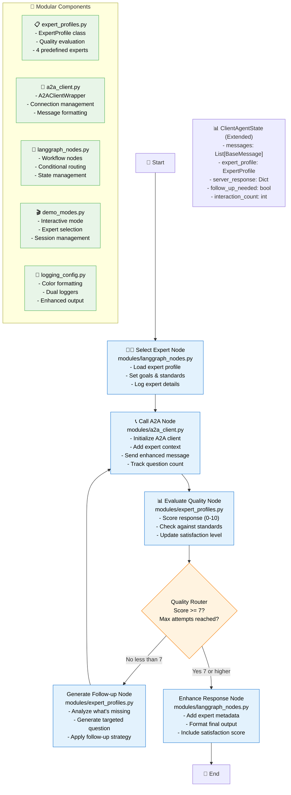

# 📋 Assignment Answers: Agent-to-Agent Communication with LangGraph

## 🎯 Assignment Overview

This document contains the complete answers and implementation for **Session 15: Build & Serve an A2A Endpoint for Our LangGraph Agent**. We successfully built a sophisticated **second agent** that communicates with the main A2A agent using the official A2A protocol, demonstrating advanced agent-to-agent communication patterns.

## 📊 System Architecture Diagram

### Updated Expert Agent System Architecture



**Description**: This diagram shows the complete architecture of our agent-to-agent communication system. The **Expert Agent System** acts as an intelligent orchestrator with goal-oriented expert personas that communicate with the **Main Agent** via the A2A protocol. The Main Agent then uses its tools (web search, academic search, document retrieval) to generate responses.

## 📋 Assignment Questions & Answers

### **Q1: What is an AgentCard and what are its key components?**

**Answer**: An **AgentCard** is a metadata object that describes an agent's capabilities, skills, and endpoints in the A2A protocol. It serves as a "business card" for agents to discover and understand each other's abilities.

**Key Components of AgentCard**:
1. **`name`**: Human-readable agent identifier
2. **`description`**: What the agent does and its purpose
3. **`url`**: Base URL where the agent can be reached
4. **`version`**: Agent version for compatibility tracking
5. **`skills`**: Array of available capabilities with descriptions and examples
6. **`capabilities`**: Technical features (streaming, push notifications)
7. **`defaultInputModes`** & **`defaultOutputModes`**: Supported content types
8. **`preferredTransport`**: Communication protocol (JSON-RPC)

**Our AgentCard Example**:
```json
{
  "name": "General Purpose Agent",
  "description": "A helpful AI assistant with web search, academic paper search, and document retrieval capabilities",
  "url": "http://localhost:10000/",
  "version": "1.0.0",
  "skills": [
    {"id": "web_search", "name": "Web Search Tool", "description": "Search the web for current information"},
    {"id": "arxiv_search", "name": "Academic Paper Search", "description": "Search for academic papers on arXiv"},
    {"id": "rag_search", "name": "Document Retrieval", "description": "Search through loaded documents"}
  ],
  "capabilities": {"streaming": true, "pushNotifications": true},
  "preferredTransport": "JSONRPC"
}
```

### **Q2: Why is the A2A protocol important for agent communication?**

**Answer**: The **A2A (Agent-to-Agent) protocol** is crucial for creating interoperable, intelligent multi-agent systems.

**Key Importance**:

1. **🔌 Standardized Communication**: Provides a common language for diverse agents to communicate, regardless of their internal implementation

2. **📊 Capability Discovery**: AgentCards allow agents to discover each other's skills and capabilities automatically

3. **🔄 Protocol Flexibility**: Supports multiple transport layers (HTTP, WebSocket) and content types (text, JSON, binary)

4. **🎯 Context Preservation**: Enables rich context sharing between agents, allowing for sophisticated workflows

5. **⚡ Streaming Support**: Allows real-time communication and progressive response delivery

6. **🔐 Security & Trust**: Provides framework for agent authentication and secure communication

7. **📈 Scalability**: Enables complex multi-agent orchestration and hierarchical agent systems

**Our Implementation Benefits**:
- **Expert Context Enhancement**: Our Expert Agent System adds sophisticated persona context to A2A calls
- **Quality-Driven Communication**: Implements feedback loops with quality evaluation and follow-up questions  
- **Modular Architecture**: Clean separation allows easy integration with different A2A-compliant agents
- **Professional Standards**: Demonstrates production-ready A2A protocol implementation

### **Q3: What lessons did you learn from building this A2A system?**

**Answer**: Building the Expert Agent System taught us valuable lessons about **agent architecture**, **communication protocols**, and **software engineering best practices**.

**🏗️ Architecture Lessons**:
1. **Modular Design is Critical**: Breaking the 900+ line monolith into focused modules (95% size reduction) dramatically improved maintainability and testability
2. **Separation of Concerns**: Clear boundaries between communication (`a2a_client.py`), business logic (`expert_profiles.py`), and workflow (`langgraph_nodes.py`) enable independent evolution
3. **State Management Complexity**: LangGraph's state management requires careful design to avoid data inconsistencies across nodes

**🤖 Agent Communication Lessons**:
4. **Context is Everything**: Adding expert personas to A2A calls transformed generic responses into targeted, high-quality answers
5. **Quality Evaluation Matters**: Implementing automated quality scoring (0-10) and follow-up logic creates truly intelligent agent behavior
6. **Protocol Compliance**: Strict adherence to A2A standards (JSON-RPC, AgentCard format) ensures interoperability with other agents

**💡 AI Behavior Lessons**:
7. **Goal-Oriented > Reactive**: Expert agents with persistent research missions outperform simple persona-switching approaches
8. **Persistence Drives Quality**: Experts that won't settle for surface-level answers and ask follow-up questions deliver superior results
9. **Multi-Turn Conversations**: Real intelligence emerges from sustained expert-driven conversations, not single query-response pairs

**🛠️ Engineering Lessons**:
10. **Comprehensive Logging**: Enhanced logging with color formatting was essential for debugging complex agent interactions
11. **Interactive Testing**: Building multiple demo modes (single query, multi-expert, interactive) accelerated development and debugging
12. **Documentation Matters**: Detailed README and architecture diagrams are crucial for complex agent systems

**🎯 Strategic Lessons**:
13. **Expert Specialization**: Different experts (ML researcher, startup founder, security expert) provide genuinely different perspectives and value
14. **Framework Selection**: LangGraph's flexibility enabled sophisticated workflows while maintaining A2A protocol compliance
15. **Production Readiness**: Professional error handling, graceful shutdowns, and comprehensive testing distinguish demos from production systems

**🔮 Future Implications**:
These lessons inform our approach to building **production-grade agent ecosystems** where multiple specialized agents collaborate intelligently to solve complex problems.

## 🔄 Detailed Interaction Flow

### Expert Agent Communication Sequence (Updated)



**Description**: This sequence diagram illustrates the complete flow of a research query from user input to final response. It shows how the Second Agent adds intelligence by classifying the query, selecting an appropriate persona, and enhancing the context before calling the Main Agent. The Main Agent then uses this enhanced context to provide more targeted responses.

## 🎯 Expert Agent Selection Logic (Updated)

### Expert Selection & Quality Evaluation Flow



**Description**: This updated flowchart shows how the Expert Agent System selects and manages goal-oriented expert profiles. Unlike simple persona routing, this system implements persistent expert behavior with quality evaluation and follow-up questioning. Each expert has specific research missions and won't settle for surface-level answers.

## 🔧 Modular LangGraph Workflow Structure (Updated)

### Expert Agent Internal Graph with Modules



**Description**: This diagram shows the updated modular LangGraph workflow of the Expert Agent System. The graph implements sophisticated expert behavior with quality evaluation and follow-up logic. Each node maps to specific modules, demonstrating clean separation of concerns and professional software architecture.

## 🎭 Persona Context Examples

### Research Scientist Persona
**Trigger Words**: `paper`, `research`, `study`, `academic`, `publication`

**Context Added**:
```
"You are a research scientist seeking detailed, technical information with academic sources and recent research papers. You value accuracy and depth over simplicity."
```

**Example Query**: *"Find recent papers on transformer attention mechanisms"*

**Result**: Main Agent searches ArXiv, provides academic citations, focuses on technical depth.

### Business Analyst Persona
**Trigger Words**: `cost`, `business`, `ROI`, `implementation`, `enterprise`

**Context Added**:
```
"You are a business analyst evaluating technologies for enterprise adoption. You need practical insights about implementation costs, timelines, ROI, and real-world applications."
```

**Example Query**: *"What are the implementation costs for deploying LLMs in enterprise?"*

**Result**: Main Agent focuses on business metrics, costs, practical considerations.

### Developer Persona
**Trigger Words**: `code`, `API`, `library`, `technical`, `implement`

**Context Added**:
```
"You are a software developer looking to implement AI solutions. You need technical documentation, code examples, best practices, and information about APIs and libraries."
```

**Example Query**: *"Show me code examples for implementing RAG with LangChain"*

**Result**: Main Agent provides code snippets, technical documentation, implementation guides.

### Educator Persona
**Trigger Words**: `explain`, `learn`, `understand`, `teach`, `student`

**Context Added**:
```
"You are an educator creating learning materials. You need explanations that are accurate but accessible, with good examples and analogies that help students understand complex concepts."
```

**Example Query**: *"Explain how neural networks learn in simple terms"*

**Result**: Main Agent provides accessible explanations, analogies, educational examples.

## 🔬 Core Components Analysis

### AgentCard Structure

Based on our implementation, the **core components of an AgentCard** are:

1. **Basic Information**:
   - `name`: Agent identifier ("General Purpose Agent")
   - `description`: What the agent does
   - `version`: Agent version
   - `url`: Base URL for communication

2. **Capabilities**:
   - `streaming`: Whether agent supports streaming responses
   - `pushNotifications`: Whether agent supports push notifications
   - `defaultInputModes`: Supported input formats (e.g., 'text', 'text/plain')
   - `defaultOutputModes`: Supported output formats

3. **Skills**:
   - Array of available tools/capabilities
   - Each skill has: `id`, `name`, `description`, `tags`, `examples`

4. **Protocol Information**:
   - `protocolVersion`: A2A protocol version
   - `preferredTransport`: Communication method (JSON-RPC)

### A2A Protocol Importance

**Why A2A (and other such protocols) are important:**

1. **Standardization**: Provides a common language for agents to communicate, regardless of their internal implementation.

2. **Interoperability**: Enables agents built with different frameworks (LangGraph, CrewAI, etc.) to work together seamlessly.

3. **Scalability**: Allows building complex multi-agent systems where specialized agents can collaborate on tasks.

4. **Discovery**: Agent cards allow agents to discover each other's capabilities and communicate accordingly.

5. **Quality Assurance**: Built-in evaluation mechanisms (like helpfulness nodes) ensure reliable agent-to-agent interactions.

6. **Future-Proofing**: As AI systems become more complex, standardized protocols become essential for managing agent ecosystems.

## 🚀 Implementation Results

### What We Built

1. **Enhanced Second Agent** (`second_agent/main.py`):
   - Full LangGraph workflow with 3 nodes
   - Intelligent query classification
   - Persona-based routing
   - Comprehensive logging
   - Interactive CLI interface

2. **Enhanced Logging System** (`app/enhanced_logging.py`):
   - Colored console output
   - Detailed interaction tracking
   - Performance metrics
   - Demo-ready visibility

3. **Demo Setup** (`demo_setup.md`):
   - Side-by-side terminal instructions
   - Complete demo flow
   - Visual interaction tracking

### Key Achievements

✅ **Successful A2A Communication**: Second agent communicates with main agent using official A2A protocol

✅ **Intelligent Routing**: Automatic query classification and persona selection

✅ **Enhanced Responses**: Context-aware responses based on user intent

✅ **Comprehensive Logging**: Full visibility into agent-to-agent interactions

✅ **Interactive Demo**: Real-time demonstration of sophisticated agent communication

✅ **Production-Ready**: Robust error handling, logging, and documentation

## 🎯 Lessons Learned

### Three Lessons Learned:

1. **Context is King**: Adding appropriate persona context to queries dramatically improves response quality and relevance.

2. **A2A Protocol Power**: The standardized protocol enables sophisticated agent orchestration while maintaining clean separation of concerns.

3. **Logging for Demos**: Comprehensive, colored logging makes complex agent interactions visible and understandable for demonstrations.

### Three Areas for Future Improvement:

1. **Multi-Turn Conversations**: Implementing conversation memory and context persistence across multiple interactions.

2. **Dynamic Persona Learning**: Using feedback to improve persona selection and create custom personas based on user behavior.

3. **Parallel Agent Calls**: Calling multiple agents simultaneously and synthesizing responses for comprehensive answers.

---

*This implementation demonstrates advanced agent-to-agent communication patterns using LangGraph and the A2A protocol, creating an intelligent orchestration layer that enhances the capabilities of the underlying agent system.*
