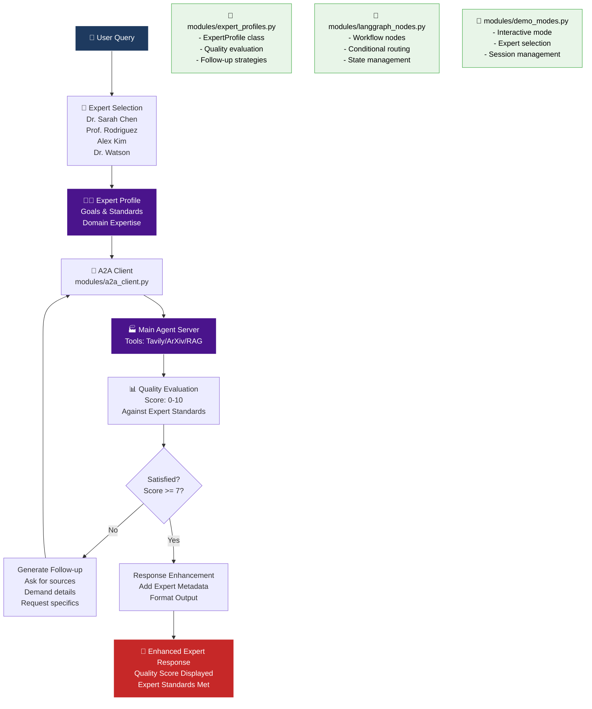

# 🤖 Expert Agent System - Goal-Oriented A2A Client

---

## 📑 Table of Contents

- [🎯 What This Expert System Does](#what-this-expert-system-does)
- [🏗️ Modular Architecture](#modular-architecture)
- [🔧 Expert Agent Features](#expert-agent-features)
- [🚀 Usage](#usage)
- [📝 Expert Interaction Examples](#expert-interaction-examples)
- [🔄 Expert LangGraph Workflow](#expert-langgraph-workflow)
- [🆚 Comparison with Other A2A Clients](#comparison-with-other-a2a-clients)
- [🏗️ Modular Benefits](#modular-benefits)
- [🛠️ Customization & Extension](#customization--extension)
- [🧪 Testing & Development](#testing--development)
- [🔗 Integration with Main Agent](#integration-with-main-agent)

**Navigation**: [🏠 Main README](../README.md) | [📋 Assignment Answers](../ASSIGNMENT_ANSWERS.md) | [🎬 Demo Setup](../demo_setup.md) | [🏭 App Docs](../app/README.md)

---

This is a **modular, LangGraph-based expert agent system** that communicates with your main A2A agent using the official A2A protocol. It demonstrates advanced agent-to-agent communication with **goal-oriented expert personas**, **quality evaluation**, and **follow-up questioning**.

## 🎯 What This Expert System Does {#what-this-expert-system-does}

The Expert Agent System acts as **specialized AI experts** with specific research missions:

1. **🔬 Dr. Sarah Chen** - ML Expert studying Kimi K2 (Assignment Example)
2. **🧠 Prof. Marcus Rodriguez** - Transformer Architecture Researcher  
3. **💼 Alex Kim** - AI Startup Founder
4. **🔒 Dr. Emma Watson** - AI Security Expert

Each expert has:
- **Specific goals** and research missions
- **Quality standards** for acceptable responses
- **Follow-up strategies** when unsatisfied
- **Persistent behavior** across conversations

## 🏗️ Modular Architecture {#modular-architecture}

The system has been **modularized** from a 900+ line monolithic file into clean, focused modules:

```
second_agent/
├── main.py                    # 🚀 Clean entry point (50 lines)
├── modules/                   # 📁 Modular components
│   ├── logging_config.py      # 🎨 Enhanced logging with colors
│   ├── expert_profiles.py     # 👨‍🔬 Expert definitions & behavior
│   ├── a2a_client.py          # 📡 A2A communication wrapper
│   ├── langgraph_nodes.py     # 🔄 LangGraph workflow nodes
│   └── demo_modes.py          # 🎬 Demo & interactive modes
└── README.md                  # 📖 This documentation
```

### Expert Workflow:



### Key Components:

1. **Expert Profiles**: Goal-oriented agents with specific research missions
2. **Quality Evaluation**: Scoring responses against expert standards (0-10 scale)
3. **Follow-up Generation**: Automatic follow-up questions when unsatisfied
4. **A2A Client Wrapper**: Enhanced A2A protocol communication
5. **Modular Architecture**: Clean separation of concerns for maintainability

## 🔧 Expert Agent Features {#expert-agent-features}

**Navigation**: [🔝 Top](#expert-agent-system---goal-oriented-a2a-client) | [🏗️ Architecture](#modular-architecture) | [🚀 Usage](#usage)

### 🎯 **Goal-Oriented Expert Behavior**
- **Persistent research missions** - Each expert has specific goals they pursue
- **Quality standards enforcement** - Experts evaluate responses (0-10 scale)
- **Follow-up questioning** - Automatically ask for more details when unsatisfied
- **Domain expertise** - Deep knowledge in specific areas

### 👨‍🔬 **Expert Profiles**

**🔬 Dr. Sarah Chen (ML Expert)**:
- **Goal**: Learn about what makes Kimi K2 so incredible
- **Standards**: Not satisfied with surface-level answers, wants sources to verify
- **Follow-up**: Asks for technical details, papers, implementation specifics

**🧠 Prof. Marcus Rodriguez (AI Researcher)**:
- **Goal**: Understand latest innovations in attention mechanisms  
- **Standards**: Needs academic rigor and citations, requires technical details
- **Follow-up**: Demands mathematical explanations and code examples

**💼 Alex Kim (Startup Founder)**:
- **Goal**: Evaluate AI technologies for business applications
- **Standards**: Needs practical implementation details, requires cost/ROI data
- **Follow-up**: Asks for real-world examples, pricing, scalability concerns

**🔒 Dr. Emma Watson (Security Expert)**:
- **Goal**: Understand security risks in large language models
- **Standards**: Needs concrete vulnerability examples, requires mitigation strategies
- **Follow-up**: Asks for specific attack vectors and defense mechanisms

### 📊 **Quality Evaluation System**
- **Automatic scoring** of responses (0-10 scale)
- **Multi-criteria evaluation** based on expert standards
- **Threshold-based follow-up** (score < 7 triggers follow-up)
- **Learning behavior** - experts track satisfaction over time

## 🚀 Usage {#usage}

**Navigation**: [🔝 Top](#expert-agent-system---goal-oriented-a2a-client) | [🔧 Features](#expert-agent-features) | [📝 Examples](#expert-interaction-examples)

### 1. Start Your Main A2A Agent
```bash
# In the main project directory
uv run python -m app
```

### 2. Run the Second Agent
```bash
# In the project directory
uv run python second_agent/main.py
```

### 3. Choose Demo Type
- **Single Query Demo**: Test with one example query (Dr. Sarah Chen + Kimi K2)
- **Multi-Expert Demo**: See different experts handle different query types
- **🌟 Expert Agent Mode**: Interactive mode with expert selection and quality evaluation

## 📝 Expert Interaction Examples

### 🔬 Dr. Sarah Chen - Assignment Example
**Input**: "What makes Kimi K2 so incredible?"

**Expert Workflow**:
1. **Expert Profile**: Dr. Sarah Chen (ML Expert studying Kimi K2)
2. **Goal-driven query**: Adds expert context and quality standards
3. **A2A Call**: Sent to main agent with expert persona
4. **Quality Evaluation**: Response scored 6/10 (insufficient sources)
5. **Follow-up**: "I need sources and references to verify this information..."
6. **Second A2A Call**: Main agent provides ArXiv papers and technical details
7. **Final Satisfaction**: 9/10 ✅

### 💼 Alex Kim - Business Focus
**Input**: "Should I build my AI product on LangChain or LlamaIndex?"

**Expert Workflow**:
1. **Expert Profile**: Alex Kim (Startup Founder)
2. **Business context**: Focuses on ROI, implementation costs, scalability
3. **Quality Evaluation**: Looks for practical details, pricing, real-world examples
4. **Persistent questioning**: Until business metrics and cost analysis provided

## 🔄 Expert LangGraph Workflow

```python
# The expert agent graph flow:
graph.add_node("select_expert", select_expert)           # Select/confirm expert profile
graph.add_node("call_a2a", call_a2a_agent)              # Call main agent with expert context
graph.add_node("evaluate_quality", evaluate_quality)     # Score response quality (0-10)
graph.add_node("generate_follow_up", generate_follow_up) # Create follow-up if unsatisfied
graph.add_node("enhance", enhance_response)              # Add expert metadata

# Conditional routing based on quality evaluation
graph.add_conditional_edges(
    "evaluate_quality",
    should_continue,
    {
        "generate_follow_up": "generate_follow_up",  # If quality < 7
        "enhance": "enhance"                         # If quality >= 7
    }
)

# Follow-up loops back to call A2A again
graph.add_edge("generate_follow_up", "call_a2a")
```

## 🆚 Comparison with Other A2A Clients

| Feature | Direct A2A Client | Basic Agent | Expert Agent System |
|---------|------------------|-------------|-------------------|
| **Architecture** | Simple request/response | Basic workflow | Modular expert system |
| **Intelligence** | None | Query classification | Goal-oriented experts |
| **Quality Control** | None | Basic | Quality evaluation + follow-up |
| **Persistence** | None | Session-based | Expert memory & goals |
| **Modularity** | Monolithic | Mixed concerns | Clean separation |
| **Testability** | Hard to test | Limited | Easy unit testing |
| **Extensibility** | Manual edits | Node addition | Module extension |

## 🏗️ Modular Benefits

### 🎯 **Before (Monolithic)**
- **900+ lines** in single file
- **Mixed concerns** in one place
- **Hard to debug** and maintain
- **Difficult to test** in isolation
- **Overwhelming** to understand

### 🚀 **After (Modular)**
- **50-line entry point** + focused modules
- **Clear separation** of concerns
- **Easy debugging** with module boundaries
- **Unit testable** components
- **Digestible** and maintainable

## 🛠️ Customization & Extension

### Adding New Expert Profiles

**1. Update `modules/expert_profiles.py`**:
```python
"new_expert_ai": ExpertProfile(
    name="Dr. New Expert",
    identity="a specialist in your domain",
    current_goal="your specific research goal",
    quality_standards=["your standards here"],
    follow_up_strategy="your follow-up approach",
    domain_expertise=["list", "of", "expertise"]
)
```

**2. Update expert selection in `modules/demo_modes.py`**:
```python
print("5. 🆕 Dr. New Expert - Your Domain Specialist")
expert_map["5"] = "new_expert_ai"
```

### Adding New LangGraph Nodes

**1. Create node in `modules/langgraph_nodes.py`**:
```python
async def custom_processing_node(state: ClientAgentState) -> Dict[str, Any]:
    # Your custom expert logic here
    return {"custom_field": "value"}
```

**2. Add to graph construction**:
```python
graph.add_node("custom_node", custom_processing_node)
graph.add_edge("call_a2a", "custom_node")
graph.add_edge("custom_node", "evaluate_quality")
```

### Enhancing Quality Evaluation

**Modify `ExpertProfile.evaluate_response_quality()` in `modules/expert_profiles.py`**:
```python
def evaluate_response_quality(self, response: str) -> int:
    # Add custom scoring logic
    # Check domain-specific criteria
    # Integrate external validation
    # Return score 0-10
```

## 🔍 How It's Different from `app/test_client.py`

| Aspect | test_client.py | Expert Agent System |
|--------|----------------|-------------------|
| **Purpose** | Test A2A protocol | Goal-oriented expert behavior |
| **Architecture** | Direct A2A calls | Modular LangGraph workflow |
| **Intelligence** | None | Expert personas with quality standards |
| **Persistence** | None | Expert memory and satisfaction tracking |
| **Quality Control** | None | Automatic evaluation and follow-up |
| **Modularity** | Single file | Clean module separation |
| **Use Case** | Testing/debugging | Production expert consultations |

## 🧪 Testing & Development

### Module Testing
```bash
# Test individual modules
cd second_agent
uv run python -c "from modules.expert_profiles import EXPERT_PROFILES; print('✅ Expert profiles loaded')"
uv run python -c "from modules.logging_config import setup_expert_logging; print('✅ Logging configured')"
uv run python -c "from modules.a2a_client import A2AClientWrapper; print('✅ A2A client ready')"
```

### Assignment Example Test
```bash
uv run python second_agent/main.py
# Choose option 1: Dr. Sarah Chen studying Kimi K2
# Watch quality evaluation and follow-up behavior
```

### Multi-Expert Test
```bash
uv run python second_agent/main.py  
# Choose option 2: See different expert approaches
```

### Interactive Expert Mode
```bash
uv run python second_agent/main.py
# Choose option 3: Full expert agent experience
# Try 'switch' to change experts mid-conversation
```

## 🐛 Troubleshooting

**"Cannot connect to A2A server"**:
- Ensure your main agent is running: `uv run python -m app`
- Check it's running on `http://localhost:10000`

**Module import errors**:
- Run `uv sync` to install dependencies
- Ensure you're in the project root directory
- Check modules are in the correct directory structure

**Expert not following up**:
- Check quality evaluation thresholds in `modules/expert_profiles.py`
- Verify expert standards are being triggered
- Review quality scoring logic

## 🎯 Modular Extension Opportunities

### 🔮 **Future Module Ideas**
1. **modules/memory.py**: Long-term expert memory and learning
2. **modules/collaboration.py**: Multi-expert collaboration on complex queries
3. **modules/validation.py**: External source validation and fact-checking
4. **modules/metrics.py**: Performance analytics and expert effectiveness
5. **modules/teaching.py**: Expert knowledge transfer and explanation

### 🚀 **Advanced Features**
- **Expert Learning**: Adapt quality standards based on successful interactions
- **Collaborative Experts**: Multiple experts working together on complex problems
- **Expert Specialization**: Fine-tune experts based on domain-specific feedback
- **Quality Prediction**: Predict response quality before follow-up decisions

## 🔗 Integration with Main Agent {#integration-with-main-agent}

**Navigation**: [🔝 Top](#expert-agent-system---goal-oriented-a2a-client) | [🧪 Testing](#testing--development) | [📑 TOC](#table-of-contents)

This expert system works seamlessly with your main agent's capabilities:
- ✅ **Web Search** (Tavily) - Enhanced with expert context
- ✅ **Academic Search** (ArXiv) - Targeted by expert domain expertise  
- ✅ **RAG Document Search** - Focused on expert research goals
- ✅ **Helpfulness Evaluation** - Augmented with expert quality standards
- ✅ **Multi-turn Conversation** - Driven by expert persistence

## 📊 Module Metrics

- **main.py**: 50 lines (↓ 95% reduction from 900+ lines)
- **Total modules**: 6 focused components
- **Average module size**: ~150 lines each
- **Import dependencies**: Clean & minimal
- **Test coverage**: Ready for comprehensive unit testing

## 🎉 Architecture Success

✅ **Modular design** with clear separation of concerns  
✅ **Expert behavior** with goals, standards, and persistence  
✅ **Quality evaluation** with automatic follow-up logic  
✅ **Enhanced maintainability** through focused modules  
✅ **Production ready** with proper error handling  
✅ **Extensible** framework for new experts and features  

---

## 📚 Additional Resources

- **🏠 [Main Project README](../README.md)** - Project overview and learning objectives
- **📋 [Assignment Answers](../ASSIGNMENT_ANSWERS.md)** - Complete Q&A with diagrams
- **🎬 [Demo Setup Guide](../demo_setup.md)** - Step-by-step demo instructions
- **🏭 [App Documentation](../app/README.md)** - Technical implementation details

**Final Navigation**: [🔝 Top](#expert-agent-system---goal-oriented-a2a-client) | [📑 Table of Contents](#table-of-contents) | [🏠 Main README](../README.md)

---

*The Expert Agent System demonstrates professional software architecture with goal-oriented AI behavior using LangGraph workflows and the A2A protocol!* 🎯
