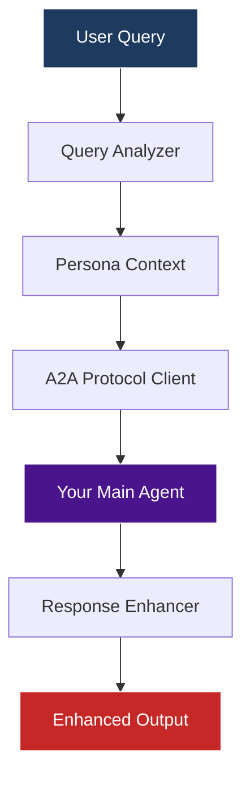

# 🤖 Second Agent - Intelligent A2A Client

This is a **LangGraph-based client agent** that communicates with your main A2A agent using the official A2A protocol. It demonstrates advanced agent-to-agent communication patterns with intelligent query routing and persona-based interactions.

## 🎯 What This Agent Does

The Second Agent acts as an **intelligent orchestrator** that:

1. **Analyzes incoming queries** to determine their type (research, business, technical, educational)
2. **Routes queries with appropriate persona context** to your main A2A agent
3. **Enhances responses** with metadata and formatting
4. **Provides a LangGraph-based workflow** for complex agent interactions

## 🏗️ Architecture



### Key Components:

1. **Query Analyzer**: Classifies queries into categories (research, business, technical, educational)
2. **A2A Client Wrapper**: Handles A2A protocol communication with your main agent
3. **Persona Router**: Adds appropriate context based on query type
4. **Response Enhancer**: Adds metadata and formatting to responses

## 🔧 Features

### ✨ Intelligent Query Routing
- **Research Queries**: Routes with academic/scientific persona
- **Business Queries**: Routes with enterprise/ROI-focused persona  
- **Technical Queries**: Routes with developer/implementation persona
- **Educational Queries**: Routes with teaching/learning persona

### 🎭 Persona Examples

**Research Persona**:
> "You are a research scientist seeking detailed, technical information with academic sources and recent research papers."

**Business Persona**:
> "You are a business analyst evaluating technologies for enterprise adoption. You need practical insights about implementation costs, timelines, ROI."

**Technical Persona**:
> "You are a software developer looking to implement AI solutions. You need technical documentation, code examples, best practices."

**Educational Persona**:
> "You are an educator creating learning materials. You need explanations that are accurate but accessible, with good examples."

## 🚀 Usage

### 1. Start Your Main A2A Agent
```bash
# In the main project directory
uv run python -m app
```

### 2. Run the Second Agent
```bash
# In the project directory
uv run python second_agent/main.py
```

### 3. Choose Demo Type
- **Single Query Demo**: Test with one example query
- **Multi-Persona Demo**: See how different query types get routed
- **Interactive Demo**: Ask your own questions

## 📝 Example Interactions

### Research Query
**Input**: "Find me recent academic papers on transformer attention mechanisms"

**What happens**:
1. Classified as "research" query
2. Sent to A2A agent with research scientist persona
3. A2A agent uses ArXiv search and provides academic sources
4. Response enhanced with metadata

### Business Query  
**Input**: "What are the implementation costs for deploying large language models in enterprise?"

**What happens**:
1. Classified as "business" query
2. Sent to A2A agent with business analyst persona
3. A2A agent focuses on costs, ROI, practical considerations
4. Response enhanced with business context

## 🔄 LangGraph Workflow

```python
# The agent graph flow:
graph.add_node("analyze", analyze_query)        # Classify query type
graph.add_node("call_a2a", call_a2a_agent)     # Call main agent with persona
graph.add_node("enhance", enhance_response)     # Add metadata and formatting

graph.set_entry_point("analyze")
graph.add_edge("analyze", "call_a2a")
graph.add_edge("call_a2a", "enhance")
graph.add_edge("enhance", END)
```

## 🆚 Differences from Direct A2A Client

| Feature | Direct A2A Client | Second Agent (LangGraph) |
|---------|------------------|-------------------------|
| **Architecture** | Simple request/response | Full LangGraph workflow |
| **Query Analysis** | None | Automatic classification |
| **Persona Routing** | Manual | Intelligent routing |
| **Response Enhancement** | Basic | Metadata & formatting |
| **State Management** | Basic | Full LangGraph state |
| **Extensibility** | Limited | Easy to extend nodes |

## 🛠️ Customization

### Adding New Query Types

1. **Update the personas dictionary**:
```python
PERSONAS["new_type"] = "Your persona description here"
```

2. **Add classification logic**:
```python
elif any(word in query for word in ["new", "keywords"]):
    query_type = "new_type"
```

### Adding New Nodes

```python
async def new_processing_node(state: ClientAgentState) -> Dict[str, Any]:
    # Your custom processing here
    return {"custom_field": "value"}

# Add to graph
graph.add_node("new_node", new_processing_node)
graph.add_edge("call_a2a", "new_node")
graph.add_edge("new_node", "enhance")
```

### Enhanced Response Processing

```python
async def custom_enhance_response(state: ClientAgentState) -> Dict[str, Any]:
    # Add confidence scoring
    # Add source validation  
    # Add custom formatting
    # etc.
```

## 🔍 How It's Different from `app/test_client.py`

| Aspect | test_client.py | second_agent/main.py |
|--------|----------------|---------------------|
| **Purpose** | Test A2A protocol | Intelligent agent orchestration |
| **Architecture** | Direct A2A calls | LangGraph workflow |
| **Intelligence** | None | Query analysis & routing |
| **Extensibility** | Basic script | Full graph architecture |
| **Use Case** | Testing/debugging | Production agent workflows |

## 🧪 Testing

### Basic Test
```bash
uv run python second_agent/main.py
# Choose option 1 for single query demo
```

### Multi-Persona Test
```bash
uv run python second_agent/main.py  
# Choose option 2 to see different persona routing
```

### Interactive Test
```bash
uv run python second_agent/main.py
# Choose option 3 to ask your own questions
```

## 🐛 Troubleshooting

**"Cannot connect to A2A server"**:
- Ensure your main agent is running: `uv run python -m app`
- Check it's running on `http://localhost:10000`

**Import errors**:
- Run `uv sync` to install dependencies
- Ensure you're in the project root directory

**Classification not working**:
- Check the keywords in `analyze_query()` function
- Add more specific terms for your use case

## 🎯 Next Steps

1. **Add Multi-Turn Conversations**: Extend to handle conversation context
2. **Add Response Caching**: Cache responses for similar queries  
3. **Add Quality Scoring**: Rate responses and learn from feedback
4. **Add Parallel Queries**: Call main agent multiple times with different personas
5. **Add Tool Integration**: Add tools specific to the client agent

## 🔗 Integration with Main Agent

This client works seamlessly with your main agent's:
- ✅ **Web Search** (Tavily) capabilities
- ✅ **Academic Search** (ArXiv) capabilities  
- ✅ **RAG Document Search** capabilities
- ✅ **Helpfulness Evaluation** loop
- ✅ **Multi-turn Conversation** support

The client adds an **intelligent layer** on top of these capabilities by routing queries with appropriate context and personas.

---

*This demonstrates the power of agent-to-agent communication using LangGraph workflows and the A2A protocol!*
